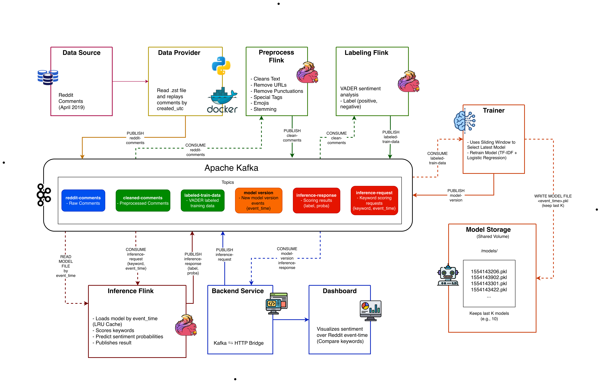

# Real-Time Reddit Sentiment Analysis Pipeline

A real-time sentiment analysis system built on **Apache Kafka**, **Apache Flink (PyFlink)**, and **FastAPI**. The pipeline replays Reddit comments as a live stream, continuously trains versioned **TF-IDF + Logistic Regression** sentiment models on the labeled stream, and serves keyword sentiment on demand — letting you plot *how sentiment for a keyword changes over time*.

## Architecture



### How it works

1. **`data-provider`** decompresses `RC_2019-04.zst` (Reddit comments, April 2019) and replays them into the `reddit-comments` Kafka topic, preserving original event-time spacing scaled by `SPEED_FACTOR`.
2. **`preprocess-flink`** (PyFlink) cleans each comment body — lowercasing, URL stripping, punctuation removal (emojis preserved), Snowball stemming — and writes to `cleaned-comments`.
3. **`labeling-flink`** (PyFlink) labels each cleaned comment using **VADER** compound scores (positive / negative / neutral) and writes to `labeled-train-data`.
4. **`trainer`** consumes labeled data in a sliding window and retrains a binary **TF-IDF (50k features, 1–2 grams) + LogisticRegression** model per batch (neutral samples are dropped). Each model is versioned by the **Reddit event-time** it represents, saved atomically to a shared volume as `/models/<event_time>.pkl` (only the last K kept), and announced on the `model-version` topic.
5. **`inference-flink`** (PyFlink) is request-driven: it consumes `inference-request` messages `{request_id, keyword, event_time}`, lazily loads the requested model version (LRU-cached), scores the keyword, and emits the result to `inference-response`.
6. **`backend`** (FastAPI) bridges Kafka and HTTP: it tracks new model versions, fans out inference requests for all watched keywords on every new version (plus backfill over past versions), collects responses into per-keyword time series, and serves the dashboard frontend.

All timestamps on the time axis are **Reddit event-time** (`created_utc`, April 2019) — never wall-clock time.

## Project Structure

```
real-time-sentiment-analysis-pipeline/
├── data-provider/          # Kafka producer — replays RC_2019-04.zst by created_utc
│   └── producer.py
├── preprocess-flink/       # PyFlink: reddit-comments → cleaned-comments
│   └── preprocess_job.py
├── labeling-flink/         # PyFlink: cleaned-comments → labeled-train-data (VADER)
│   └── labeling_job.py
├── train-consumer/         # Trainer: labeled-train-data → versioned models + model-version
│   ├── train.py
│   └── data/               # Oracle dataset (evaluation)
├── inference-flink/        # PyFlink: inference-request → inference-response
│   └── inference.py
├── flink-job/              # Legacy/experimental Flink job
├── backend/                # FastAPI REST API + Kafka bridge + dashboard
│   ├── app.py
│   └── static/             # Frontend (HTML/JS/CSS)
├── diagram/                # Architecture diagram, training pipeline, Gantt chart
├── dataset/                # Place RC_2019-04.zst here (not in repo)
├── docker-compose.yml
└── requirements.txt
```

## Prerequisites

- Docker Engine + Docker Compose v2 (≥ 8 GB RAM recommended)
- The `RC_2019-04.zst` Reddit comments dataset placed in `./dataset/`
  - Source: [Pushshift Reddit comment dumps](https://files.pushshift.io/reddit/comments/) — only the comments file is needed

## Quick Start

```bash
# 1. Clone
git clone https://github.com/Saidul-Mursalin-Khan/real-time-sentiment-analysis-pipeline.git
cd real-time-sentiment-analysis-pipeline

# 2. Place the dataset
mkdir -p dataset
# copy RC_2019-04.zst into ./dataset/

# 3. Build and start everything
docker compose build
docker compose up -d

# 4. Check that services are healthy
docker compose ps
```

Startup order is handled automatically: `zookeeper` → `kafka` → `kafka-init` (creates topics) → Flink jobs, trainer, data provider, and backend.

Once the trainer has produced its first model (watch `docker logs -f trainer`), open the dashboard.

## Web UIs

| URL | Service |
|---|---|
| http://localhost:8000 | Dashboard (frontend + API) |
| http://localhost:8000/docs | Swagger API docs |
| http://localhost:8080 | Kafka UI — topics, messages, consumer groups |

## Kafka Topics

| Topic | Partitions | Retention | Purpose |
|---|---|---|---|
| `reddit-comments` | 8 | 1 h | Raw comments from `data-provider` |
| `cleaned-comments` | 8 | 1 h | Preprocessed comments |
| `labeled-train-data` | 4 | 1 h | VADER-labeled samples fed to the trainer |
| `model-version` | 1 | 24 h | New model version events `{event_time}` |
| `inference-request` | 4 | 1 h | Keyword scoring requests `{request_id, keyword, event_time}` |
| `inference-response` | 4 | 1 h | Scoring results `{label, proba, …}` |

## Services

| Service | Description | Host Port |
|---|---|---|
| `zookeeper` | Kafka coordination | — |
| `kafka` | Message broker | 29092 |
| `kafka-init` | One-shot topic creation | — |
| `kafka-ui` | Kafka web UI | 8080 |
| `data-provider` | Replays the `.zst` dataset into Kafka | — |
| `preprocess-flink` | PyFlink text-cleaning job | — |
| `labeling-flink` | PyFlink VADER labeling job | — |
| `inference-flink` | PyFlink version-addressed inference job | — |
| `trainer` | Continuous model retraining + versioning | — |
| `backend` | FastAPI REST API + dashboard | 8000 |

## API Endpoints

| Method | Endpoint | Description |
|---|---|---|
| GET | `/` | Dashboard frontend |
| GET | `/health` | Service health check |
| GET | `/model/status` | Number of model versions and the latest version |
| POST | `/watch` | Set keywords to track (`{"keywords": ["marvel", "python"]}`); backfills all known model versions |
| GET | `/series` | Per-keyword sentiment time series for charting |
| POST | `/analyze` | One-shot sentiment analysis of custom text against the latest model |

### Example

```bash
# Track two keywords
curl -X POST http://localhost:8000/watch \
  -H "Content-Type: application/json" \
  -d '{"keywords": ["marvel", "python"]}'

# Get the sentiment series (proba.positive is the y-value, event_time the x-value)
curl http://localhost:8000/series

# Analyze arbitrary text against the latest model
curl -X POST http://localhost:8000/analyze \
  -H "Content-Type: application/json" \
  -d '{"text": "this movie was absolutely amazing"}'
```

## ML Pipeline Details

- **Labeling** — VADER compound score with thresholds (`> 0.37` → positive, `< -0.01` → negative, otherwise neutral). Used only to create training labels (distant supervision).
- **Training** — sliding window over recent labeled batches; neutral samples are dropped so the classifier is **binary** (positive/negative). TF-IDF with 50,000 features and 1–2 grams, LogisticRegression with `class_weight='balanced'`.
- **Versioning** — each model's version id is the max `created_utc` in its training window, i.e. the Reddit event-time it represents. Models are written atomically (`.tmp` → rename) and pruned to the last `KEEP_LAST_K_MODELS`.
- **Inference** — loads models lazily by version with an LRU cache; the keyword is preprocessed with the same cleaning/stemming as training data before scoring. If a requested version has been pruned, the response contains `"available": false`.

### Gotchas

- Out-of-vocabulary keywords return the model prior with no warning — pick keywords that actually appear in the data.
- A keyword's sentiment only changes when a new model version is trained, so chart points arrive at the retrain cadence.
- The x-axis is April 2019 event-time, not the current wall-clock.

## Configuration

Key environment variables (set in `docker-compose.yml`):

| Variable | Default | Service | Description |
|---|---|---|---|
| `SPEED_FACTOR` | `100` | data-provider | Replay speed multiplier |
| `MODEL_DIR` | `/models` | trainer, inference | Shared volume for model files |
| `KEEP_LAST_K_MODELS` | `10` | trainer | Versioned models kept on disk |
| `MODEL_CACHE_SIZE` | `10` | inference | Models held in memory (LRU) |
| `KEEP_VERSIONS` | `50` | backend | Model versions remembered for backfill |
| `KAFKA_BROKER` | `kafka:9092` | all | Kafka bootstrap server |

## Verify Data Is Flowing

```bash
# Watch the producer replaying comments
docker logs -f data-provider

# Watch the trainer producing model versions
docker logs -f trainer

# Inspect topic message counts in Kafka UI
open http://localhost:8080
```

## Reset Everything

```bash
# Stop all containers and delete all volumes (Kafka data, models)
docker compose down -v

# Optionally reclaim Docker disk space
docker system prune -f
```

## Tech Stack

- **Apache Kafka** (Confluent 7.5.0) — event streaming backbone
- **Apache Flink / PyFlink** — stream processing (preprocess, labeling, inference)
- **scikit-learn** — TF-IDF + Logistic Regression
- **VADER** — lexicon-based sentiment labeling
- **FastAPI + Uvicorn** — REST API and dashboard backend
- **Docker Compose** — orchestration
