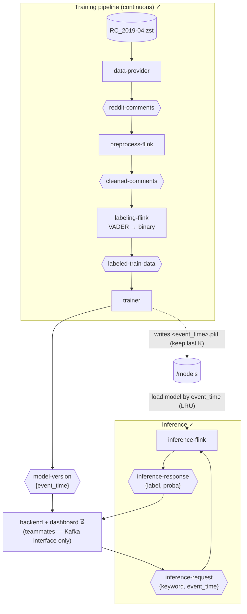

# Handoff from ML pipeline

End-to-end realtime sentiment analysis system for Reddit comments. Comments are streamed through Kafka and processed by Flink jobs (cleaning → labeling) to continuously **retrain** a binary (positive/negative) sentiment model on the labeled stream. Each retrained model is tagged with the **Reddit event-time** it represents and published as a version event. Sentiment for a keyword is served **on demand**: downstream requests a keyword against a specific model version, an inference Flink job scores the keyword, and writes the result back over Kafka. Plotting a keyword's sentiment across successive model versions gives "how sentiment changes over time". **No database — only Kafka topics + model files on a shared volume.**

This is a 6-person group project (TUHH SoSe 2026, Topic A). This doc covers the **ML side** (training + inference) and the **Kafka interface** to the backend/dashboard. Backend and dashboard are owned by other teammates — only the topic contracts below are part of this handoff.

## Architecture

`✓` = built and runnable &nbsp;&nbsp; `⏳` = owned by other teammates



## Status / Roadmap

| Component | Status |
|---|---|
| Data provider | ✓ Built |
| Preprocess Flink | ✓ Built |
| Labeling Flink (VADER → binary) | ✓ Built |
| Trainer (versioned models + `model-version`) | ✓ Built |
| Inference Flink (version-addressed keyword scoring) | ✓ Built |
| Backend (Kafka ⇄ HTTP bridge) | ⏳ Teammates |
| Dashboard UI (2-keyword compare over time) | ⏳ Teammates |
| Cloud deployment | ⏳ TODO |

## Project Structure

```
bd26_project_f6_a/
├── data-provider/          # .zst → reddit-comments (replays by created_utc)
├── preprocess-flink/       # reddit-comments → cleaned-comments
├── labeling-flink/         # cleaned-comments → labeled-train-data (VADER, binary)
├── inference-flink/        # inference-request → inference-response (keyword scoring)
├── train-consumer/         # labeled-train-data → /models/<event_time>.pkl + model-version
├── scripts/
│   └── glove_poc.py        # offline experiment (GloVe vs TF-IDF) — not in the pipeline
├── dataset/RC_2019-04.zst  # Reddit dataset (not in repo)
└── docker-compose.yml
```

Backend / dashboard directories are added by their owners.

## Prerequisites

- Docker Desktop (≥ 8GB RAM)
- Docker Compose v2
- `RC_2019-04.zst` placed in `./dataset/`

## Quick Start

```bash
docker compose build
docker compose up -d
docker compose ps        # all services Up / Up (healthy)
```

Start order: `zookeeper` → `kafka` → `kafka-init` (creates topics) → all Flink jobs + trainer.

## Web UIs

| URL | What |
|---|---|
| http://localhost:8080 | **Kafka UI** — view topics, messages, consumer groups |

## Kafka Topics

| Topic | Partitions | Retention | Purpose |
|---|---|---|---|
| `reddit-comments` | 8 | 1h | Raw comments from data-provider |
| `cleaned-comments` | 8 | 1h | After URL/punct/stemming preprocessing |
| `labeled-train-data` | 4 | 1h | VADER-labeled (binary), fed to trainer |
| `model-version` | 1 | 24h | New model version events `{event_time}` (trainer → downstream); longer retention so a late client can backfill |
| `inference-request` | 4 | 1h | Keyword scoring requests `{request_id, keyword, event_time}` (downstream → inference) |
| `inference-response` | 4 | 1h | Results `{label, proba, …}` (inference → downstream) |

## ML Pipeline

### Labeling (lexicon-based, for training data only)
**VADER** compound score → **binary** label `positive` / `negative` (used to label training data only).

### Training (rolling window distant supervision, versioned)
The trainer keeps a sliding window of recent `labeled-train-data` and retrains a **TF-IDF (50k features) + LogisticRegression (binary, `class_weight='balanced'`)** model every batch. On each retrain it:
1. Computes `event_time = max(created_utc)` over the training window — the **Reddit event-time this model represents** (also serves as the version id).
2. Writes `/models/<event_time>.pkl` atomically (tmp → rename) and prunes to the most recent **K** models (`KEEP_LAST_K_MODELS`, default 10).
3. Publishes `{"event_time": <event_time>}` to the **model-version** topic.

`BATCH_SIZE` / `WINDOW_SIZE` are set in `train-consumer/train.py` (small values for a fast demo; production-scale would be 200000 / 2).

### Inference (version-addressed keyword scoring)
`inference-flink` is a request-driven PyFlink `MapFunction`:
1. Consumes `inference-request` `{request_id, keyword, event_time}`.
2. Loads `/models/<event_time>.pkl` (lazy, LRU-cached up to `MODEL_CACHE_SIZE`, default 10).
3. `vectorizer.transform([keyword])` — **no stemming** (model trained on raw `body`; sklearn's default analyzer lowercases/tokenises) → `predict_proba`.
4. Emits `inference-response` (schema below).

## Services

| Service | Description | Port |
|---|---|---|
| `zookeeper` | Kafka coordination | — |
| `kafka` | Message broker (ZK mode) | 29092 |
| `kafka-init` | One-shot topic creation | — |
| `kafka-ui` | Web UI for Kafka | 8080 |
| `data-provider` | Replays `.zst` to `reddit-comments` by `created_utc` | — |
| `preprocess-flink` | PyFlink: clean text | — |
| `labeling-flink` | PyFlink: VADER → binary label | — |
| `inference-flink` | PyFlink: keyword request → sentiment response | — |
| `trainer` | Retrain + versioned models + `model-version` | — |

## Configuration

| Variable | Default | Description |
|---|---|---|
| `SPEED_FACTOR` | `100` | `data-provider` replay speed multiplier |
| `MODEL_DIR` | `/models` | Shared volume for model files |
| `KEEP_LAST_K_MODELS` | `10` | Versioned models retained on disk (trainer) |
| `MODEL_CACHE_SIZE` | `10` | Models held in memory (inference LRU) |

---

# Downstream Interface (backend / dashboard)

This is the **only** contract teammates need. The backend is a Kafka ⇄ HTTP bridge; its internal design is up to you. All times on the x-axis are **Reddit event-time** (`created_utc`, April 2019) — never wall-clock.

### Three topics

**1. `model-version`** (trainer → you) — a new model exists:
```json
{ "event_time": 1554143206 }
```
`event_time` is both the **version id** and the **x-axis coordinate** of any point produced from this model.

**2. `inference-request`** (you → inference) — score `keyword` against the model version `event_time`:
```json
{ "request_id": "uuid", "keyword": "marvel", "event_time": 1554143206 }
```
- `keyword`: raw, as typed — do **not** stem/lowercase, the job handles it.
- `event_time`: which model version to score against (from a `model-version` event).

**3. `inference-response`** (inference → you):
```json
{
  "request_id": "uuid",
  "keyword": "marvel",
  "event_time": 1554143206,
  "label": "positive",
  "proba": { "negative": 0.215, "positive": 0.785 }
}
```
Model-version-not-found case: `{ ...request fields, "available": false }`.

| Field | Notes |
|---|---|
| `request_id`, `keyword`, `event_time` | echoed from the request |
| `label` | binary: `"positive"` or `"negative"` |
| `proba` | two keys summing to 1. `"X% positive"` = `proba.positive × 100`; plot `proba.positive` as the y-value |

### Expected flow

1. **Consume `model-version`.** Each event = a new point in time.
2. **On a new version**, for every keyword being shown, produce an `inference-request` `{keyword, event_time}`.
3. **Consume `inference-response`**, correlate by `request_id`, plot `proba.positive` at x = `event_time`.
4. **Backfill on connect:** read the recent `model-version` history and request each shown keyword × each version to populate the curve immediately.

### Gotchas

- **x-axis is Reddit event-time** (the `event_time` field), April 2019 — not the wall-clock of the request.
- **Binary**: `label` is `positive`/`negative` only; `proba` has exactly those two keys (no neutral).
- **OOV keywords** (not in the model's vocabulary) return the model prior with no flag — pick keywords present in the data.
- **Resolution**: a keyword's value only changes when a new model version appears, so points arrive at the retrain cadence (one per `model-version` event).
- Handle the `available: false` response (requested a version whose file was already pruned).

## Verify / Reset

- **Data flowing:** Kafka UI (http://localhost:8080) → topic message counts.
- **Reset:** `docker compose down -v` (removes Kafka data + model storage).
